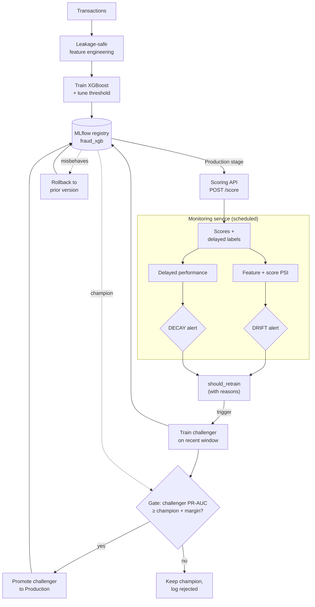
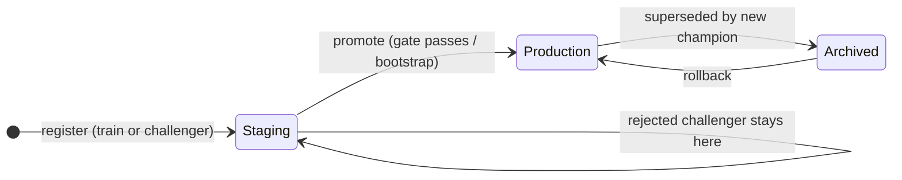
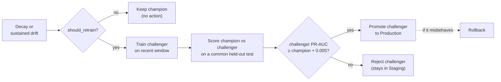

# Methodology

Deep-dive companion to the [README](README.md). The README owns the proof (what it
is, the numbers, that it runs); this file owns the *how* — feature engineering,
the streaming feature store, serving, monitoring, and the full model-lifecycle
loop. Everything here is local: an MLflow **file store** under `./mlruns`,
JSON-Lines history under `reports/monitoring/`, no server and no cloud.

---

## Feature engineering

All features are computed **causally** — using only information available strictly
before each transaction's timestamp (`src/feature_engineering.py`).

| Feature | Description |
|---|---|
| `seconds_since_last_txn` | Time since this customer's previous transaction. First-ever transaction gets a large sentinel value, not 0. |
| `velocity_count_{10,60,1440}m` | Count of this customer's transactions in the trailing 10min/1hr/24hr window, excluding the current transaction. |
| `velocity_amount_{10,60,1440}m` | Sum of `$` amount in the same trailing windows. |
| `merchant_risk_score` | Smoothed target-encoded historical fraud rate per merchant, fit on the training split only. |
| `merchant_category_risk_score` | Same, aggregated at the merchant-category level (groceries vs. crypto exchange vs. gambling, etc.). |
| `is_new_device` | Whether this is a device not previously seen for this customer (as of this point in time). |
| `distinct_device_count_so_far` | Running count of distinct devices used by this customer. |

This recreation implements velocity, recency, merchant-risk, and
device-consistency features. Geo-mismatch and graph-based merchant-user linkage
features (also used in the production system this recreates) are not yet
implemented here — see the README's "Limitations".

## Imbalance handling

Configurable via `--imbalance_strategy`:

- `class_weight` (default): `scale_pos_weight` for XGBoost / `class_weight="balanced"` for sklearn models — reweights the loss rather than touching the data.
- `smote`: oversamples the minority class via SMOTE **after** the time-based split (never before — fitting SMOTE before splitting would leak synthetic points derived from val/test fraud examples into training).
- `none`: no correction, useful as a baseline to see how much the above actually help.

Decision threshold is tuned on the **validation set only**
(`src/imbalance.py::tune_threshold_for_f1`), reporting both the F1-optimal
threshold and a precision-constrained "high recall" alternative (useful when the
business wants to cap analyst false-positive review load at a minimum precision).

## Explainability

`src/explainability.py` uses SHAP's `TreeExplainer` for two purposes:

- **Global**: `reports/shap_summary.png` and `reports/shap_top_features.csv` — which features drive the model overall (for model governance / validation review).
- **Local**: `explain_single_transaction()` — surfaces the top contributing factors for one transaction, returned directly in the `/score` API response when `explain: true` is passed. This is what a fraud analyst's alert-triage UI would show.

---

## Real-time feature store

The velocity/recency/device features are cheap to compute in batch over a whole
DataFrame but impossible to recompute per-request at 1M+ txns/day.
`src/online_features.py` is the online counterpart: a **stateful streaming
aggregator** that maintains per-customer state incrementally and serves the exact
same features the batch pipeline produces.

**Two-phase, causal contract.** Every transaction is handled in two steps:

```python
feats = store.get_features(txn)   # state AS OF NOW, excluding this txn
# ...score the model...
store.commit(txn)                 # fold this txn in, for FUTURE txns
```

`get_features` never sees the current transaction in its own state — velocity
excludes the current row, `is_new_device` is evaluated against prior devices
only — exactly mirroring the batch semantics (which get the same guarantee from
sort + shift). `commit` is what makes a transaction count for the *next* one.
This ordering is the causality guarantee; scoring always happens before the
commit.

**Redis data structures** (per `customer_id`):

| Key | Type | Purpose |
|---|---|---|
| `fs:vel:{cid}` | **sorted set**, score = txn epoch seconds | Sliding-window velocity. `ZRANGEBYSCORE (now-w, now]` gives a window's events in `O(log N + K)`; `ZREMRANGEBYSCORE` ages out anything past the largest window. Member is `"{epoch}|{amount}|{txn_id}"` so amounts are recoverable for windowed sums and members stay unique. |
| `fs:last:{cid}` | string | Last txn epoch → `seconds_since_last_txn` (large sentinel, never 0, on first-ever txn). |
| `fs:dev:{cid}` | set | Distinct device ids → `is_new_device` + `distinct_device_count_so_far`. |

A time-scored sorted set *is* a sliding window: old events age out with one range
delete and any window (10m/60m/1440m) is a single range query. TTLs keep memory
bounded for dormant customers. Commits run inside a `MULTI` pipeline so
concurrent workers can't interleave a partial update. Merchant risk is a static
offline lookup (from `merchant_risk_map.joblib`), not streaming state, so it
stays a plain dict lookup.

**In-memory fallback.** `InMemoryFeatureStore` implements the same interface
(with a per-customer lock) so the repo runs and all tests pass with **no Redis
server**. Select the backend with `FEATURE_STORE_BACKEND=redis|memory` and
`REDIS_URL`.

**Train/serve parity — the guardrail.** `tests/test_streaming_parity.py` runs a
fixed transaction stream through *both* the batch pipeline and the streaming
store and asserts the feature rows are identical (both backends). This is the
proof that the serving path didn't silently drift from what the model was trained
on. Batch and streaming reference a single definition of the window widths and
the first-txn sentinel (`src/feature_engineering.py`) rather than two copies.

## Deployment / serving

`src/api.py` is a FastAPI service exposing `POST /score`, with two ways to supply
the time-dependent features:

- **Store-backed** (`"use_feature_store": true`): the service fetches
  velocity/recency/device features from the online store using the transaction's
  ids; the caller passes only the raw txn fields (V1-V28, Amount, ids,
  timestamp). Set `"ingest": true` to commit the txn after scoring.
- **Caller-provided** (default): the caller passes all features pre-computed —
  the original contract, kept for backward compatibility.

`POST /ingest` folds a transaction into the store without scoring (warmup /
backfill). `GET /health` is for liveness/readiness probes and reports the serving
`model_version`. Bring up Redis + the API together with `docker compose up --build`.

### Load test / latency

`loadtest/` drives concurrent store-backed `/score` requests after warming the
store with realistic per-customer history. On an **Apple M4 laptop, single
uvicorn worker, in-memory backend**, the measured result over 20,000 requests
(warm store, concurrency 8) was:

| Throughput | p50 | p95 | p99 | errors |
|---|---|---|---|---|
| **435 RPS** | 18.1 ms | 24.2 ms | **27.8 ms** | 0 |

p99 well under the 100ms target. Throughput is bounded by a single CPU-bound
Python worker; the production config (N workers + Redis for shared state, via
`docker-compose.yml`) scales RPS roughly linearly across cores. Full numbers, the
concurrency sweep, and the scaling analysis are in
[loadtest/results.md](loadtest/results.md) — every number there is from a real
run, not hand-written.

---

## Monitoring

`src/monitoring.py` separates two distinct failure modes, since they need
different responses:

- **Data drift** (`compute_feature_drift_report`, `compute_prediction_drift`):
  Population Stability Index per feature and on the model's output score
  distribution. Available immediately, no ground truth needed. PSI < 0.1 stable,
  0.1-0.25 investigate, > 0.25 significant shift.
- **Concept drift / performance decay** (`compute_delayed_performance_report`):
  recomputes precision/recall/F1 once delayed ground-truth labels (chargebacks,
  confirmed fraud reports) arrive for a past batch. This is the primary
  retraining trigger — data drift alone doesn't necessarily mean the model got
  worse.

`src/monitoring.py` holds the *functions*; `src/monitoring_service.py` is what
actually **runs** them on a cadence, persists a timestamped history under
`reports/monitoring/`, and alerts.

---

## Model lifecycle

Training a model once and dumping a `.joblib` is where most demos stop. Operating
a fraud model means *running* the loop that keeps it honest after deployment:
versioning what ships, watching it decay, and retraining under a gate that
refuses to promote a worse model.



### 1. Registry (`src/registry.py`)

Every training run logs to MLflow and registers the model under **`fraud_xgb`**,
carrying — as versioned artifacts — the exact **threshold**, **feature list**,
**merchant-risk encoders**, held-out **metrics** (ROC-AUC / PR-AUC / precision /
recall / F1), and a **data fingerprint** (row count + SHA-256 of the sorted row
keys + date range) so any registered model traces back to the precise rows and
config that produced it. Two **stages** are used:

| Stage | Meaning |
|---|---|
| `Staging` | a freshly trained or challenger version, not yet serving |
| `Production` | the single version the API serves right now — the **champion** |



`promote_to_production(v)` moves a version to Production and archives the
incumbent (so "what are we serving?" is never ambiguous); `rollback_to_version(v)`
is just promoting a known-good older version back. `train.py` auto-promotes the
*first* model (bootstrap); after that, promotion is a **gated** decision, never
automatic.

> MLflow is pinned to 2.x on purpose: we use registry **stages** and the local
> **file store**, both of which MLflow 3 deprecates (3.x replaces stages with
> aliases and puts the file backend in maintenance mode).

### 2. Serving from the registry (`src/api.py`)

The API loads the **Production-stage** model at startup — resolved *by stage*, not
a hardcoded artifact path — together with the threshold and feature list that were
registered with it, so the served threshold always matches the served model. **A
new promotion is picked up on restart** (a deliberate, safe default — no
mid-flight model swaps under load; a real deployment would do a rolling restart on
promotion, or add a guarded hot-reload endpoint).

### 3. Monitoring cadence (`src/monitoring_service.py`)

`run_monitoring_cycle()` runs each cycle (default **hourly**,
`MONITORING.interval_seconds`): per-feature **PSI** and **prediction-score PSI**
against the stored training reference, persisted to
`reports/monitoring/drift_history.jsonl`. A separate delayed-labels job
(`run_delayed_performance_cycle()`) recomputes realized precision/recall/F1 as
ground truth arrives, to `performance_history.jsonl`. The two alerts are kept
**distinct** because they mean different things:

- **DRIFT** alert — inputs/scores shifted (≥ `min_significant_features` in the
  significant PSI band, or the score distribution shifts). Investigate; maybe an
  early retrain.
- **DECAY** alert — realized F1/recall fell below its floor. The model actually
  got worse. Retrain.

Alerts emit a structured log line, plus a webhook POST **only if** you set
`FRAUD_ALERT_WEBHOOK` (never a hardcoded endpoint).

### 4. Retraining policy + the gate (`src/retraining.py`)

`should_retrain(...)` is an explicit, config-driven policy that returns **why**,
not just a bool:

| Trigger | Condition | Thresholds (`src/config.py :: RETRAIN`) |
|---|---|---|
| **decay** (primary) | realized F1 below floor **or** dropped sharply vs the training baseline | `decay_f1_abs_floor=0.05`, `decay_f1_relative_drop=0.25` |
| **drift** (secondary/early) | significant drift **sustained** across cycles | `drift_sustained_cycles=2`, `drift_min_significant_features=3` |

On trigger, a **challenger** is trained on the newer data window — via the exact
same leakage-safe pipeline (`src/training_core.py`) as the champion — and
registered to `Staging`. The **gate** then compares challenger vs champion on a
common, chronologically-held-out test split, on **PR-AUC** (the metric that
matters under extreme imbalance), and promotes the challenger **only if it beats
the champion by ≥ `promotion_min_pr_auc_gain` (0.005)**. Otherwise the champion
keeps serving and the challenger is logged as rejected. **The gate is the point:
never auto-promote a worse model.** `run_retraining_flow(...)` orchestrates the
whole thing — `monitor → detect → retrain → evaluate → gated promote/reject →
record` — as a plain Python function; in a real deployment each step would be a
task in Airflow / Prefect / Kubeflow (noted in the code).



### Simulated-decay demo — the loop firing end to end

Absolute scores on the synthetic data are weak by construction (see the README's
Results); the point here is the **lifecycle mechanics**, demonstrated by injecting
a **clearly-labelled simulated** concept-drift event (fraud moves to different PCA
components; old ones scrambled; amount inflation) into a recent data window and
watching the machinery react:

```bash
python scripts/simulate_decay_demo.py
```

Real output from a run (trimmed):

```
2. DRIFT check:  drift_alert=True | 7 features in significant PSI band:
                 ['V7','V9','V24','V20','V22','Amount']... | score PSI=0.1953
3. DECAY check:  decay_alert=True | realized: precision=0.0220 recall=0.2699 F1=0.0407
4. should_retrain=True triggers=['decay','drift'] severity=critical
     - realized F1 0.0407 below absolute floor 0.05
     - realized F1 0.0407 is 41% below training baseline 0.0685 (> 25% allowed)
     - significant drift sustained 2 consecutive cycles, 7 features shifted
5. GATE (accept):  champion pr_auc=0.01827 vs challenger 0.95134
                   (gain +0.933, margin 0.005) -> PROMOTE_CHALLENGER
6. GATE (reject):  champion pr_auc=0.98598 vs stale challenger 0.01918
                   (gain -0.967, margin 0.005) -> KEEP_CHAMPION
7. ROLLBACK:       Production v3 -> v2 (verified)
```

Step 5 shows the gate **accepting** a genuinely better challenger; step 6 shows it
**rejecting** an inferior one (a challenger accidentally trained on the stale
regime) — both directions, on real trained models. Step 7 shows a one-call
rollback. The realized numbers above come from an actual run, not hand-written.
