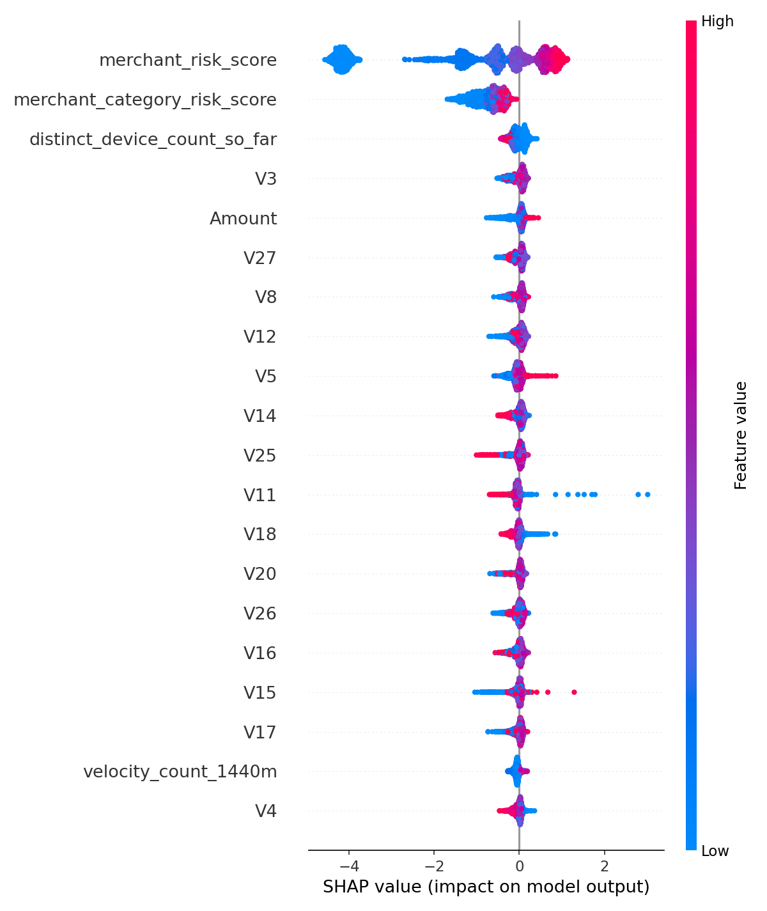
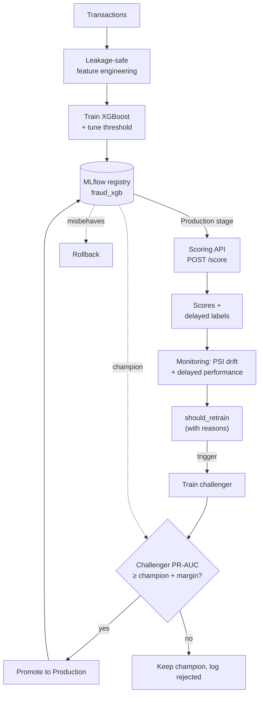

# Fraud Detection Platform

Production-style credit-card fraud detection pipeline (XGBoost) with leakage-safe
feature engineering, a versioned model registry, drift monitoring, and gated
champion/challenger retraining — built for the constraints of a real payments
environment (1M+ transactions/day, ~0.1–0.3% fraud rate, sub-100ms scoring).


📄 **Full write-up:** https://www.hridaysaha.com/projects-1/fraud-detection-platform

## Results

> **Data note:** these numbers are a ceiling test on **synthetic** data, not a
> claim about real-world performance. The PCA-style features here are randomly
> generated with only a modest, artificial fraud/legit shift. The value of this
> repo is the **pipeline design** — leakage-safe splits, imbalance handling,
> validation-only threshold tuning, a working lifecycle loop — **not** the
> absolute numbers. Real transaction data carries far more separating signal.

| Model | ROC-AUC | PR-AUC | Precision | Recall | F1 |
|---|---|---|---|---|---|
| Logistic Regression | 0.542 | 0.101 | 0.026 | 0.463 | 0.050 |
| Random Forest | 0.757 | 0.136 | 0.048 | 0.733 | 0.091 |
| XGBoost (tuned threshold, F1-optimal) | 0.722 | 0.109 | 0.067 | 0.262 | 0.106 |
| XGBoost (default 0.5 threshold) | 0.722 | 0.109 | 0.051 | 0.554 | 0.094 |



XGBoost gives the best PR-AUC/F1 tradeoff overall. Random Forest reaches the
highest recall (catches ~73% of fraud) at a very high false-positive rate — the
precision/recall tradeoff a real fraud team tunes against analyst review
capacity, which is exactly what `src/imbalance.py` exists to control.

## Why this is non-trivial

1. **Extreme class imbalance** (~0.1–0.3% positive) — accuracy is useless (predict "not fraud" always = 99.8%). We report Precision/Recall/F1/PR-AUC.
2. **Temporal leakage** — a random split leaks the future through rolling features. Every split and feature here is **time-based and causal** (`src/data_loader.py::time_based_split`).
3. **Delayed ground truth** — chargebacks arrive days/weeks later, so data drift (immediate) and performance decay (only once labels land) are treated as two separate monitoring problems.
4. **Explainability is a compliance requirement** in financial services — SHAP drives both global model validation and per-transaction analyst explanations.

## Approach

Data → leakage-safe features → imbalance handling → model comparison →
validation-only threshold tuning → SHAP → registry → API serving → drift/decay
monitoring → gated retraining. Each trained model registers to a local MLflow
registry; the API serves whichever version is in the `Production` stage; the
monitoring service watches drift and decay and can trigger a challenger promoted
**only if it beats the champion on PR-AUC**.



Full details — streaming feature store internals, monitoring cadence, registry
stages, the retraining gate — are in **[METHODOLOGY.md](METHODOLOGY.md)**.

## Data

The canonical public benchmark is the Kaggle
["Credit Card Fraud Detection"](https://www.kaggle.com/mlg-ulb/creditcardfraud)
set (~285K European card transactions, Sept 2013: `Time`, 28 PCA features
`V1`-`V28`, `Amount`, `Class`). It is **fully anonymized** — no customer, merchant,
or device ids — so it can't demonstrate velocity, merchant-risk, or
device-consistency features, which need entity identifiers.

`data/generate_synthetic_data.py` ships transactions with the **same schema** plus
`customer_id`, `merchant_id`, `merchant_category`, `device_id`, and a real
`timestamp`, so the full feature set builds end-to-end. **To use real Kaggle
data:** drop `creditcard.csv` at `data/transactions.csv` and run `train.py` —
`src/data_loader.py` detects the missing identity columns and synthesizes them on
top of the real `Amount`/`V1-V28`/`Class` values (a stand-in for a real warehouse
join), keeping the fraud signal genuine. Split is **time-based**, never random.

## Model

Three models trained and compared on the same chronologically-last test split
(`reports/model_comparison.json`):

1. **Logistic Regression** — fast interpretable baseline / signal sanity check.
2. **Random Forest** — stronger nonlinear baseline and feature-importance cross-check.
3. **XGBoost** — the production model: accuracy/latency tradeoff at volume, native `scale_pos_weight`, exact/fast SHAP via `TreeExplainer`.

Imbalance strategy is configurable (`--imbalance_strategy class_weight|smote|none`;
SMOTE is applied **after** the split, never before). The decision threshold is
tuned on the **validation set only** (`src/imbalance.py::tune_threshold_for_f1`).

## Evaluation

**PR-AUC and F1, not accuracy** — under ~0.1% positives, accuracy rewards always
predicting "not fraud", while PR-AUC/F1 measure whether real fraud is caught.
Tuning is on validation, never test; the test split is the chronologically-last
window, so no future leaks in. The champion/challenger gate also compares on PR-AUC.

## Reproduce it

Pinned deps in `requirements.txt`; **seed = 42** throughout (`DATA.random_state`).

```bash
pip install -r requirements.txt

# 1. Generate data (or drop a real transactions.csv in data/ — see Data)
python data/generate_synthetic_data.py --n_rows 500000 --fraud_rate 0.0017

# 2. Train, evaluate, SHAP, and register to the local MLflow registry.
#    The first model is auto-promoted to Production (the champion).
python train.py --imbalance_strategy class_weight   # regenerates the headline numbers

# 3. Serve the current Production model (resolved by stage, not a hardcoded path)
FEATURE_STORE_BACKEND=memory uvicorn src.api:app --host 0.0.0.0 --port 8000
#    ...or Redis-backed API + Redis together:  docker compose up --build

# 4. Tests (leakage sanity, streaming/batch parity, lifecycle)
pytest tests/ -v

# 5. Watch the whole lifecycle fire on a simulated concept-drift event:
#    decay detected -> challenger trained -> gate accepts, then rejects -> rollback
python scripts/simulate_decay_demo.py

# 6. (optional) Browse the registry / runs:  mlflow ui --backend-store-uri ./mlruns
# 7. (optional) Load test /score:            python loadtest/loadtest.py --host http://localhost:8000
```

## Repo map

```
data/    synthetic data generator (Kaggle-schema-compatible) + inputs
src/     pipeline: features, imbalance, models, evaluate, explainability,
         online_features (streaming store), api, monitoring(+_service),
         registry, training_core, retraining
scripts/ end-to-end simulated-decay lifecycle walkthrough
tests/   leakage sanity, train/serve parity, lifecycle (gate/promote/rollback)
loadtest/ concurrency load test + real RPS/p50/p95/p99 results
reports/ generated metrics, SHAP plots, monitoring history (jsonl)
mlruns/  local MLflow tracking + registry file store (gitignored)
train.py end-to-end training entry point
```

## Limitations & next steps

- Synthetic fraud/legit separation is simplified; a real deployment validates against confirmed investigation outcomes, not just held-out PR-AUC.
- No hyperparameter search (fixed reasonable XGBoost defaults) — wire in Optuna/Ray Tune before treating as final.
- No formal model card / bias audit across customer segments — add before regulated production use.
- The champion/challenger gate scores both models on a common matrix encoded with the *challenger's* encoders (fair between them, flagged in `src/retraining.py`); a fuller setup re-featurizes per model.
- Geo-mismatch and graph-based merchant-user linkage features are not yet implemented.
- Model promotion is picked up on API **restart** — no hot-reload endpoint wired in (noted in `src/api.py`).
- The demo's decay is a **deliberately injected, clearly-labelled simulated** concept shift, used only to exercise the trigger/gate/rollback mechanics — not a claim about real drift magnitudes.

## License

MIT © Hriday Saha — see [LICENSE](LICENSE).
